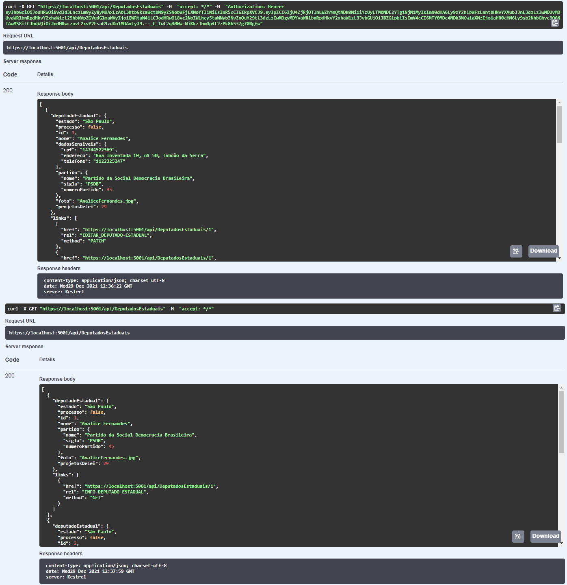

<h1 align="center">Desafio API</h1> 

Implementação de duas APIs. A primeira consiste em uma API para cadastro e gerenciamento de Políticos de diversos cargos (Presidente, Governador, Prefeito, Deputado Federal, Senador, Deputado Estadual, Vereador e Ministros de Estado), enquanto a segunda é uma API para consumir os dados provenientes da primeira.

---
## :memo: Descrição dos Programas

**<h3>API 1 - CADASTRO</h3>**

A primeira API é responsável por cadastrar, editar, deletar e mostrar os dados de políticos, de acordo com o cargo de cada um. Além disso, para facilitar os cadastros, também gerencia as informações de partidos políticos. Configurada para rodar na porta 5001 do localhost, possui as seguintes entidades: 

- Partido: com as propriedades Id, Nome, Sigla e Número do Partido. 

- LiderPartido: apesar de poder ser apenas mais uma propriedade de partido, o nome do líder na câmara foi separado para que o cadastro seja feito por partido, mas que esse dado seja mostrado apenas para Deputados Federais.

- Politico: possui as propriedades básicas de todos os políticos a serem cadastrados, como Id, Nome, Dados Sensíveis, Partido, Foto e Número de Projetos de Lei.

- PoliticoProcessavel: herda da classe Politico e acrescenta a propriedade Processo, que indica se o político em questão já foi ou não processado.

- DadoSensivel: consiste em Id, CPF, Endereço e Telefone. Não foi diretamente incorporado a político por questões de tratamento de dados.

- DeputadoEstadual: herda da classe PoliticoProcessavel e acrescenta a propriedade de Estado (UF).

- DeputadoFederal: herda da classe PoliticoProcessavel e acrescenta as propriedades de Estado (UF) e Líder. Esta última não é mapeada no Banco de Dados, para evitar redundância.

- Governador: herda da classe PoliticoProcessavel e acrescenta a propriedade de Estado (UF).

- MinistroDeEstado: herda da classe Politico e acrescenta a propriedade Pasta.

- Prefeito: herda da classe Politico e acrescenta as propriedades de Estado (UF) e Cidade.

- Presidente: herda da classe Politico.

- Senador: herda da classe Politico e acrescenta a classe de Estado (UF).

- Vereador: herda da classe Politico e acrescenta as propriedades de Estado (UF) e Cidade.

Para cada uma das entidades, excluindo Politico e PoliticoProcessavel, há endpoints responsáveis por suas operações CRUD. O LiderPartido, no entanto, não possui um controlador próprio, sendo adicionado no mesmo momento da criação ou edição de um Partido.

As informações dos métodos GET são enviadas de formas diferentes, a depender do usuário estar logado como um Admin ou não. 

_
Figura 1 - Retorno de informações para usuário logado como admin (superior) e para usuários não logados (inferior)
_

**<h3>API 2 - CONSUMO</h3>**

A segunda API é responsável apenas por consumir as informações enviadas pela primeira, não conseguindo mostrar os dados sensíveis de qualquer político. Nesta API, não será possível visualizar os dados dos partidos, apenas dos políticos. Além disso, possui um controlador próprio para registro e login de usuários. Configurada para a porta 9001 do localhost, suas entidades foram modeladas de acordo com as respostas enviadas pela primeira API, sem dados sensíveis e sem links não disponíveis para um usuário comum. Apesar de estar disponível para usuários comuns, eles precisarão se registrar e logar ao sistema antes de ter acesso a qualquer uma das funcionalidades.

---
## :floppy_disk: Banco de Dados

MySql foi configurado na porta 3306, com uid e senha iguais a root. Para a primeira API, será criado automaticamente o banco de nome desafio_api_mano_cadastro assim que aplicação for iniciada pela primeira vez. Similarmente, haverá a criação de um banco chamado desafio_api_mano_consumo para a segunda API. 

Para a primeira API, serão criados automaticamente dois registros de cada tipo de político acima relacionados com seus respectivos dados sensíveis, além de oito registros de Partidos e Líderes e um usuário administrador. 

Já para a segunda API, foi criado um registro de usuário comum, necessário para acessar qualquer um dos endpoints.

Os dados de login dos usuários criados automaticamente são os seguintes: 

API | Perfil | Usuário | Senha |
-----|------|---------|------|
API 1 - CADASTRO| Admin | Admin | Gft2021 |
API 2 - CONSUMO| Comum | henrique@email.com | Gft2021 |

---
## :loudspeaker: Informações importantes

As duas APIs foram feitas separadamente, não sendo partes de uma só solução. Desta forma, cada uma deverá ser rodada separadamente para que funcionem.

[API 1 - CADASTRO](https://github.com/CarolineMano/desafio-api/tree/master/CADASTRO)  

[API 2 - CONSUMO](https://github.com/CarolineMano/desafio-api/tree/master/CONSUMO)  

Além disso, será necessário configurar o certificado HTTPS para que seja confiável. Para isto, basta utilizar o seguinte comando: 

> dotnet dev-certs https --trust

---

## :notebook_with_decorative_cover:	Documentação

Swagger foi utilizado para a documentação das APIs. Após a inicialização das aplicações, haverá uma breve descrição de seus endpoints, além das entradas esperadas e as possíveis saídas. Através do Swagger, será possível também testar a API, tendo-se em mente que para algumas funcionalidades da primeira API e para todas da segunda será necessário gerar um token e autorizá-lo através do botão "Authorize" no canto superior direito da tela.

---